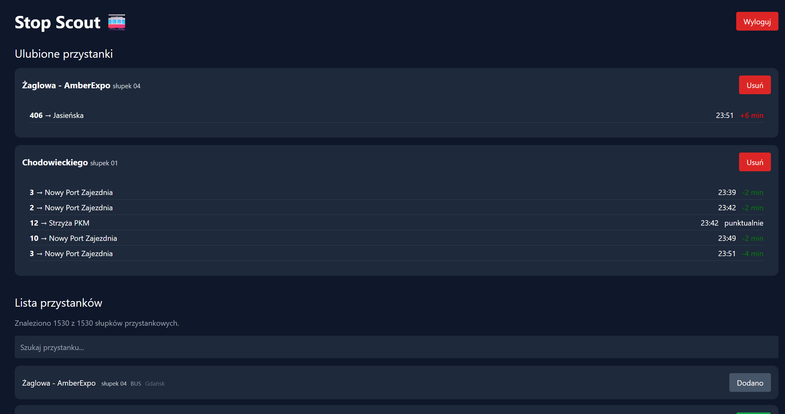

# Stop Scout

Live bus and tram departures for Gdansk, as an installable web app that keeps
working when the network drops. It runs on the city's open ZTM data.

I wrote it as a university project and then went back and fixed the things that
were wrong with it.

<!-- Add these together with docs/screenshot.png:


**[Live demo](https://stop-scout.vercel.app)** once it is deployed.
-->

## What it does

- Departure board with delays against the timetable, refreshed every 10 seconds
- Stop search that ignores Polish diacritics, so "gdansk" finds "Gdansk"
- Favourite stops, saved per user
- Offline: keeps showing the last departures it managed to fetch, and says that
  is what you are looking at
- Installs as a PWA

The interface is in Polish, because the data and the passengers are.

## Running it

```bash
npm install
npm run dev       # dev server
npm test          # unit tests
npm run build     # production build
```

## Stack

Vue 3 with `<script setup>`, Vite, Pinia, Vue Router, Tailwind, Dexie for
IndexedDB, vite-plugin-pwa for the service worker, Vitest.

## The parts I had to think about

### Departures and the stop list are cached differently

I first put both through the service worker, and both broke in their own way.

For the stop list I used cache-first with an expiry, which looks like the
obvious choice and is not. Once an entry ages out, Workbox counts it as a miss
and goes to the network, so the list stopped working offline after a day.
`StaleWhileRevalidate` does what I actually wanted: serve the cache straight
away, refresh in the background.

Departures I took out of the service worker completely. A `NetworkFirst` route
answers an offline request with `ok: true` out of its own cache, so the app
cannot tell a live response from an old one and will happily show times from
ten minutes ago as current. They go into IndexedDB instead, where I hold the
timestamp myself and can say what is on screen.

That is why `fetchDepartures` returns a status and not just data:

| `status` | What happened | What the user sees |
|---|---|---|
| `live` | fresh from the API | no badge |
| `offline` | request failed and `navigator.onLine` is false | amber, "Brak sieci - dane z HH:MM" |
| `error` | request failed while online, so ZTM is down | red, "Serwis ZTM nie odpowiada" |

I kept the last two apart on purpose. Telling someone with a working connection
to go and check their connection is useless.

The cache write sits outside the request's `try`, so if storage fails on its own
(private browsing, blocked site data, quota) it cannot throw away departures
that arrived fine. All of this is covered in
`src/services/departuresApi.test.js`.

### Delays are in minutes, not seconds

ZTM sends `delayInSeconds`, and it goes negative when a vehicle is ahead of its
timetable. An early departure is real data, not a bug in my code.

I show minutes, because `+403s` leaves the passenger dividing by 60 at a bus
stop. Under a minute it reads "punktualnie": I render times to the minute
anyway, so anything smaller is invisible in the time itself, and the value
jitters by a few seconds between polls. The colour uses the same threshold, so
the text and the colour cannot contradict each other.

### Telling poles apart

The list is poles, not stops. 1530 poles share 696 names, and "Dworzec Glowny"
alone is twelve of them, so the name cannot identify a row.

I started with `stopDesc` and picked the wrong field. For most poles it just
repeats the name, including all twelve at the Dworzec, so the rows I needed to
separate were exactly the ones it could not help with. Where it did differ it
usually added a city that `zoneName` already gives ("Gdynia Kameliowa") or
spelled the same name another way ("al. Plazynskiego" against "Aleja
Plazynskiego").

What works is `subName`, the pole number printed on the sign. It is filled in
for all 1530 entries, so I show it next to the vehicle type and dropped
`stopDesc`.

The one useful thing buried in `stopDesc` was the "(N/Z)" request-stop marker,
so I kept `onDemand` instead and print "na zadanie". The two do not fully
agree: 414 poles carry the marker in the text, 366 have the flag set. I went
with the flag because it is the field meant for this, not because I can show it
is the correct one.

Name plus pole number still collides 22 times out of 1530. Separating those
needs the coordinates, and the trim script drops them.

## The stop list file

The raw dump from Otwarty Gdansk is 14.4 MB: 16 timetable days, around 2600
stops each, 23 fields per stop. I use one day and six fields.

`npm run trim-stops` cuts `public/stops.json` down to the newest day and the
fields that get rendered, which leaves about 0.15 MB.

## What is still wrong with it

This started as a university project and the scope shows:

- **Authentication is client-side.** Users sit in IndexedDB and passwords are
  hashed with `bcryptjs` in the browser. Only `{ id, username }` goes to
  localStorage, never the hash, but there is no backend, so this demonstrates a
  login flow rather than being one. Real auth needs a server, HTTP-only cookies
  or tokens, and rate limiting.
- The stop list is a snapshot. Refreshing it means running the trim script
  again, not a live feed.
- Search shows the first 20 matches instead of virtualising the list.
- Polling stops on a hidden tab, but every favourite still polls on its own
  timer rather than in one batched request.
- The PWA icon is an SVG. App stores would want 192 and 512 px rasters.

## Data

Transit data comes from
[Otwarte dane ZTM w Gdansku](https://ckan.multimediagdansk.pl/dataset/tristar),
published by the City of Gdansk under a Creative Commons Attribution licence.
Using it means accepting the terms published with the dataset.

## Licence

MIT, see [LICENSE](LICENSE). Covers the code here, not the transit data.
